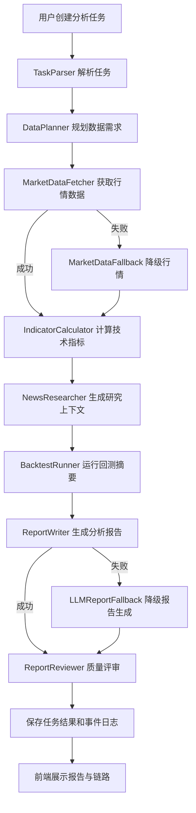

# MarketMind Agent

MarketMind Agent 是一个面向 AI Agent Engineer 求职展示的 AI 投研工作流项目。项目目标不是做“保证准确的股票预测”，而是完整呈现一个 Agent 从需求设计、工具调用、真实数据接入、LLM 接入、结果质检、前端可视化到线上部署的工程落地流程。

在线演示地址：[http://8.139.5.187:8080/](http://8.139.5.187:8080/)

> 风险提示：本项目仅用于技术学习、工程展示和 Agent 流程验证，不构成任何投资建议。

## 项目定位

本项目围绕“股票行情分析 Agent”构建一个可运行的 MVP，重点展示企业更关注的 Agent 工程能力：

- Agent 工作流编排：任务解析、行情采集、指标分析、LLM 研报生成、质量评审、结果落库。
- Tool Calling：将行情数据、LLM 生成、质量评估等能力封装为可观测工具。
- Provider 抽象：支持 Mock、真实行情 API、OpenAI-compatible LLM 的可插拔切换。
- 前后端联调：FastAPI 后端 + React 前端，支持在线创建任务、运行工作流、查看执行链路。
- 线上真实验证：已部署到云服务器，并完成真实行情数据与真实 LLM 的端到端测试。
- 面试可讲性：保留技术方案对比、架构取舍、后续优化路线，便于展示从 0 到 1 的工程思考。

## 当前状态

项目已经完成 MVP 和第一轮线上真实环境验证：

- 前端页面已中文化，支持创建分析任务、运行工作流、查看报告和执行事件。
- 后端提供 REST API、SQLite 持久化、工作流编排、工具调用记录。
- 行情数据已支持真实 provider 接入，线上环境使用 Twelve Data provider 验证通过。
- LLM 已支持 OpenAI-compatible provider，线上环境使用兼容接口验证通过。
- 已完成 AAPL 的 1 个月、3 个月、6 个月真实工作流试运行，并生成可追踪结果。

详细线上试运行记录见：[docs/REAL_WORLD_TRIAL_RESULTS.md](docs/REAL_WORLD_TRIAL_RESULTS.md)

## 核心功能

- 创建股票分析任务：输入股票代码、分析周期和风险偏好。
- 运行 Agent 工作流：自动完成数据采集、指标分析、研报生成和质量评审。
- 查看链路事件：展示每一步工具调用、执行状态、耗时和错误信息。
- 查看分析结果：包含趋势判断、置信度、关键依据、风险提示和质量评分。
- 真实/模拟模式切换：本地开发可使用 Mock provider，线上环境可接真实 API。

## 技术栈

后端：

- Python
- FastAPI
- SQLite
- Pydantic
- LangGraph
- Uvicorn

前端：

- React
- Vite
- CSS
- Lucide React
- marked

工程与部署：

- Git / GitHub
- 云服务器网站部署
- systemd 自启动服务
- Nginx 反向代理
- 环境变量配置
- OpenAI-compatible LLM API

## Agent 工作流

当前工作流采用 LangGraph 编排。主路径是清晰的顺序型 Agent workflow，同时对行情 provider 和 LLM provider 增加了显式条件 fallback 分支，便于在前端链路中观察外部依赖失败后的降级过程。



工作流核心节点：

- `TaskParser`：解析股票代码、时间周期、风险偏好等任务参数。
- `DataPlanner`：根据任务生成行情、指标和报告所需的数据计划。
- `MarketDataFetcher`：通过 provider 获取真实或模拟行情数据。
- `MarketDataFallback`：当真实行情 provider 失败时，显式降级到本地 mock OHLCV。
- `IndicatorCalculator`：计算收益、均线、波动、最大回撤等基础指标。
- `NewsResearcher`：生成研究上下文，后续可扩展为新闻/RAG 检索。
- `BacktestRunner`：生成简单回测摘要，为报告提供量化依据。
- `ReportWriter`：调用 LLM 或 Mock LLM 生成结构化研报内容。
- `LLMReportFallback`：当真实 LLM provider 失败时，显式降级到确定性报告模板。
- `ReportReviewer`：检查报告完整性、风险提示、置信度和工具证据。
- `Repository`：保存任务、步骤、工具调用、报告和质量评审结果。

## Provider 设计

项目将外部能力抽象为 provider，便于本地开发、线上部署和后续扩展。

行情 Provider：

- `MockMarketDataProvider`：本地无 API Key 时使用，生成稳定的模拟行情。
- `TwelveDataMarketDataProvider`：真实行情数据 provider，已在线上验证。
- `AlphaVantageMarketDataProvider`：备用真实行情 provider，适合扩展和对比。

LLM Provider：

- `MockLLMProvider`：本地开发使用，避免依赖外部模型。
- `OpenAICompatibleLLMProvider`：支持 OpenAI-compatible 接口，可接入通义千问、OpenAI、DeepSeek、Moonshot 等兼容服务。

质量评审 Provider：

- `ReportQualityReviewer`：对报告结构、风险说明、置信度和结论一致性进行规则化评估。

这种设计的好处：

- 本地开发不依赖真实 API，降低调试成本。
- 线上环境可以通过环境变量切换 provider。
- 后续新增数据源或模型时，不需要大规模改动工作流。
- 面试中可以清楚说明“工程抽象”和“外部服务解耦”的思路。

## 真实线上验证

线上环境已完成真实 provider 诊断和工作流试运行。

诊断结果：

| 能力 | Provider | 状态 |
| --- | --- | --- |
| 行情数据 | `TwelveDataMarketDataProvider` | 通过 |
| LLM 生成 | `OpenAICompatibleLLMProvider` | 通过 |
| 报告质检 | `ReportQualityReviewer` | 通过 |

真实任务样例：

| 任务 | 股票 | 周期 | 结论 | 置信度 | 质量分 |
| --- | --- | --- | --- | --- | --- |
| `task-aapl-1mo-003faa68` | AAPL | 1 个月 | neutral | 0.60 | 1.0 |
| `task-aapl-3mo-a8b24f03` | AAPL | 3 个月 | bullish | 0.85 | 1.0 |
| `task-aapl-6mo-2cc76b9c` | AAPL | 6 个月 | bullish | 0.75 | 1.0 |

更多记录见：[docs/REAL_WORLD_TRIAL_RESULTS.md](docs/REAL_WORLD_TRIAL_RESULTS.md)

## 本地启动

### 1. 启动后端

```powershell
cd backend
python -m venv .venv
.\.venv\Scripts\activate
pip install -r requirements.txt
python -m uvicorn app.main:app --host 127.0.0.1 --port 8000
```

后端默认地址：

```text
http://127.0.0.1:8000
```

API 文档：

```text
http://127.0.0.1:8000/docs
```

### 2. 启动前端

```powershell
cd frontend
npm install
npm run dev -- --host 127.0.0.1 --port 5173
```

前端默认地址：

```text
http://127.0.0.1:5173
```

### 3. 单端口网站模式

构建前端：

```powershell
cd frontend
npm run build
```

启动后端并托管前端静态资源：

```powershell
cd backend
python -m uvicorn app.main:app --host 0.0.0.0 --port 8000
```

## 环境变量

项目通过环境变量切换真实 provider。请不要将真实 API Key 提交到 GitHub。

示例：

```env
MARKETMIND_MARKET_DATA_PROVIDER=mock
MARKETMIND_ALPHA_VANTAGE_API_KEY=your_alpha_vantage_key
MARKETMIND_TWELVE_DATA_API_KEY=your_twelve_data_key

MARKETMIND_LLM_PROVIDER=mock
MARKETMIND_LLM_API_BASE_URL=https://your-openai-compatible-endpoint/v1
MARKETMIND_LLM_API_KEY=your_llm_api_key
MARKETMIND_LLM_MODEL=your_model_name
```

推荐开发方式：

- 本地开发：使用 `mock` provider，优先调通流程。
- 联调阶段：只给测试环境配置真实行情和真实 LLM。
- 线上部署：通过服务器环境变量或 systemd service 注入密钥。

## API 概览

常用接口：

| 方法 | 路径 | 说明 |
| --- | --- | --- |
| `GET` | `/health` | 健康检查 |
| `GET` | `/api/system/capabilities` | 查询系统能力 |
| `POST` | `/api/system/provider-diagnostics` | provider 诊断 |
| `POST` | `/api/analysis-tasks` | 创建演示任务 |
| `POST` | `/api/analysis-tasks/workflow` | 创建并运行真实工作流任务 |
| `GET` | `/api/analysis-tasks` | 查询任务列表 |
| `GET` | `/api/analysis-tasks/{task_id}` | 查询任务详情 |
| `GET` | `/api/analysis-tasks/{task_id}/steps` | 查询工作流步骤 |
| `GET` | `/api/analysis-tasks/{task_id}/tool-calls` | 查询工具调用 |
| `GET` | `/api/analysis-tasks/{task_id}/report` | 查询分析报告 |

## 项目结构

```text
marketmind-agent/
├── backend/
│   ├── app/
│   │   ├── agent/            # LangGraph 节点、状态和工作流
│   │   ├── api/              # REST API
│   │   ├── core/             # 配置
│   │   ├── data/             # 演示数据
│   │   ├── db/               # SQLite 连接与仓储
│   │   ├── models/           # Pydantic schema
│   │   ├── services/         # 任务执行、诊断、演示服务
│   │   └── tools/            # 行情、指标、回测、LLM、质检工具
│   └── requirements.txt
├── frontend/
│   ├── src/
│   │   ├── api/              # API 客户端
│   │   ├── App.jsx           # 主界面
│   │   ├── main.jsx
│   │   └── styles.css
│   └── package.json
├── docs/
│   ├── ACCEPTANCE_CHECKLIST.md
│   ├── DEPLOYMENT.md
│   ├── INTERVIEW_NOTES.md
│   ├── REAL_WORLD_TRIAL.md
│   ├── REAL_WORLD_TRIAL_RESULTS.md
│   └── GITHUB_PUBLISHING.md
└── README.md
```

## 验证命令

后端基础检查：

```powershell
cd backend
python -m compileall app
```

前端构建检查：

```powershell
cd frontend
npm run build
```

线上验证重点：

- 打开首页是否正常加载。
- 调用 `/health` 是否返回健康状态。
- 调用 `/api/system/provider-diagnostics` 是否显示真实 provider 可用。
- 创建任务后运行工作流，检查是否生成报告和事件链路。

## 面试讲解点

可以围绕以下问题讲项目：

- 为什么先做顺序工作流，而不是一开始就做复杂多 Agent？
- 如何设计 provider，让 Mock、真实行情、真实 LLM 能够平滑切换？
- Tool Calling 在项目中如何体现？每个 tool 的输入输出如何记录？
- 如何证明 Agent 不是“前端假跑”，而是真实调用了数据源和 LLM？
- 线上部署时如何管理 API Key、环境变量、自启动和反向代理？
- 质量评审模块如何避免 LLM 输出不可控？
- 后续如果要做多 Agent 协作，可以如何拆分角色？

## 后续路线

短期计划：

- 增加更多股票和时间窗口的线上试运行样例。
- 增强报告质量评审规则。
- 增加更清晰的 provider 状态展示。
- 补充端到端测试和部署检查脚本。

中期计划：

- 引入多 Agent 协作，例如数据分析 Agent、风险评估 Agent、报告撰写 Agent。
- 支持 workflow DAG，让不同节点可配置、可重试、可观测。
- 增加 RAG，用于接入公司公告、财报摘要、行业新闻等文本信息。
- 增加任务队列和异步执行，支持更长时间的分析任务。

长期计划：

- 支持更多市场数据源和模型供应商。
- 增加用户侧 API Key 配置能力。
- 增加更完整的评测集，用于比较不同模型和不同工作流策略的效果。
- 将项目整理为完整的 Agent 工程实践案例，用于简历、面试和技术博客。

## 免责声明

MarketMind Agent 生成的内容仅用于技术演示和学习，不保证数据完整性、实时性或投资收益。任何投资决策都应基于独立判断和专业建议。
